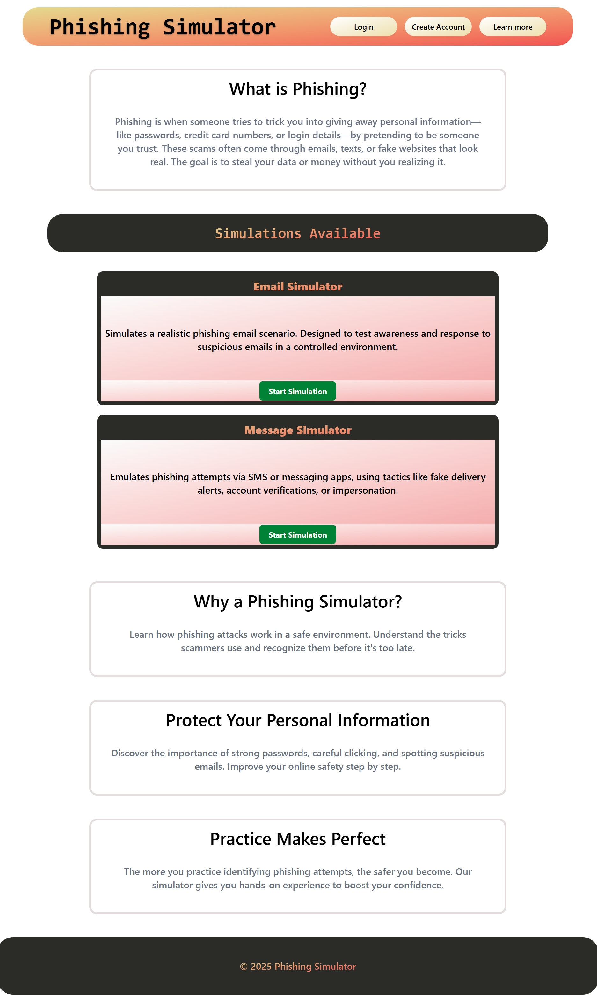

# Phishing Simulator

> 🚧 **Note:** This project is still in development and will be published to the web once it’s fully functional.

## 📝 Description

Phishing is one of the most common online threats today. It’s surprisingly easy for people — especially those who aren't trained — to fall for realistic-looking scams. That’s where this project comes in!

The **Phishing Simulator** is designed to help you train your audience (parents, grandparents, friends — anyone!) to spot phishing attempts in a safe and controlled environment.

---

## ⚙️ Prerequisites

> These may change as development continues, but this section will be kept up to date.

- Install [**Node.js**](https://nodejs.org/) (includes `npm`)

To check if Node and npm are installed:
```bash
node -v
npm -v
```

If not installed, download it from the link above and follow the setup instructions for your OS.

---

## Getting Started

### 1. Clone the Repository

Open your terminal and run:

```bash
git clone <your-repo-link>
cd keeper
```

> Replace `<your-repo-link>` with the actual GitHub link to this repo.

### 2. Install Dependencies

Run:

```bash
npm install
```

This will install all required packages for both the client and server (if applicable).

---

## ✨ Features

1. **User Accounts**
   - Track user progress across simulations.
   - Receive updates and tips to stay sharp.

2. **Phishing Simulators**
   - 📧 **Email Phishing Simulator**
   - 💬 **Message Phishing Simulator**
   - 🌐 **Website Phishing Simulator** *(Planned for a future update)*

Each simulator will have its own realistic environment to train in.

---

## App Screenshots & User Experience

### 1. Home Page

- Shows two phishing simulator options (UI in progress).
- Offers a simple, clean layout for beginners.



---

## 💬 Feedback & Contributions

If you have suggestions or want to contribute:
- Open an [issue]()
